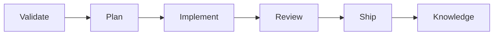

# Dev Lifecycle

Full engineering lifecycle for turning a ticket into shipped, reviewed, documented code. Six phases — each builds on the last, each has explicit quality gates.

## Flow



**Entry:** A ticket, issue, or task — from Linear, GitHub, a PRD, or a plain description.

**Exit:** Merged PR with captured knowledge (when warranted).

---

## Phase 1: Validate

**Mandatory first step.** Runs before planning, branching, or writing a single line of code.

### Three-Question Investigation

Every validation answers exactly three questions, backed by evidence:

**1. Does the problem still exist?**

Search the codebase for evidence. Has this already been implemented, partially solved, or been superseded?

- Grep for keywords, function names, component names related to the ticket
- Read files in the affected area — don't just search, understand the code
- Check recent commits and branches for in-progress or completed work
- Look at related tests — do they already cover this behavior?

**2. Is the proposed approach still sound?**

Does the ticket's approach conflict with current architecture, existing patterns, or prior decisions?

- Search for ADRs, decision records, or docs that affect this area
- Read the existing code's patterns — would the proposed change fight them?
- Check if dependencies or APIs the ticket assumes still exist and work
- Identify shared utilities or abstractions that should be reused

**3. Is the spec plannable as written?**

Can you produce a concrete implementation plan from this ticket?

- Are acceptance criteria testable and specific?
- Are there gaps, ambiguities, or unstated assumptions?
- Is the scope right-sized — roughly one PR's worth of work?
- Are there unresolved dependencies on other tickets or systems?

### Evidence Requirement

Every finding includes a file path and line number when relevant. No unsupported claims. If you say "this is already partially implemented," cite the file.

### Map the Blast Radius

Before rendering a verdict, list every file and module that will be touched or affected. Flag anything that's heavily depended on — changes there carry more risk.

### Verdict

| Verdict | Meaning | Next step |
|---------|---------|-----------|
| **PROCEED** | Problem exists, approach is sound, spec is clear | Move to Plan |
| **PROCEED WITH REVISIONS** | Viable, but spec needs adjustments | Produce Revised Scope, then Plan against it |
| **CLOSE** | Problem already solved or ticket is invalid | Report findings, recommend closing |

On **PROCEED WITH REVISIONS**, the Revised Scope replaces the original ticket for all downstream phases.

### Example

```
User: "Start working on the notification preferences feature"

→ Question 1: Does the problem exist?
  - Searched for "notification" and "preferences" across codebase
  - Found existing notification service at src/services/notifications/ (lines 1-89)
  - No per-category preference support exists — confirmed problem is real
  - Found user preferences table at src/db/schema.ts:42 — no notification columns

→ Question 2: Is the approach sound?
  - Read src/services/notifications/index.ts — dispatch pattern is clean, extensible
  - No ADRs about notification architecture
  - Existing pattern uses service layer + repository, approach aligns

→ Question 3: Is the spec plannable?
  - Acceptance criteria are testable: "user can toggle email/push/SMS per category"
  - Gap: ticket doesn't specify default state for existing users (on or off?)
  - Scope is right-sized: one new table, CRUD endpoints, UI component, service modification

→ Blast radius: user model, preferences API, notification service, settings UI

Verdict: PROCEED WITH REVISIONS
Revised Scope: Original ticket + "default all preferences to ON for existing users"
```

---

## Phase 2: Plan

**Purpose:** Decide how to build it before writing code. Produces a concrete, reviewable implementation plan.

### Step 1: Explore Approaches

For non-trivial tickets, generate 2-3 candidate approaches. For each:

- What changes it requires (files, schema, APIs)
- Tradeoffs (complexity, performance, maintainability, future flexibility)
- Risks and unknowns

For simple, well-understood changes where the path is obvious — skip to Step 3.

### Step 2: Plan Review Council

A structured multi-perspective review before committing to an approach. Four seats, each a distinct lens:

| Seat | Perspective | Asks |
|------|-------------|------|
| **Architect** | Structure, boundaries, long-term consequences | "Does this fit the system's direction? What breaks at 10x scale?" |
| **Adversary** | Security, correctness, failure modes | "What did we forget? How does this fail? What's the attack surface?" |
| **Reviewer** | Spec adherence, coverage gaps | "Does this actually satisfy the ticket? What's missing?" |
| **Pragmatist** | Over-engineering, YAGNI, complexity | "Is this the simplest thing that works? What can we cut?" |

**Council process (3 rounds):**

1. **Diverge** — Apply each perspective independently to the candidate approaches. Each seat produces its assessment without seeing the others.
2. **Stress-test** — Cross-examine. Each perspective challenges the others' findings. Surface contradictions and unresolved tensions.
3. **Synthesize** — Pick the winner. Rules:
   - If the Adversary killed an approach and nobody refuted it → it's dead
   - If the Pragmatist flagged unnecessary complexity and the Architect can't justify it → cut it
   - If the Reviewer found spec gaps → they must be addressed in the plan
   - Pick the most correct and robust option, even if it's more work

**Output:** Chosen approach + dissent log (unresolved disagreements, noted for future reference).

### Step 3: Write the Implementation Plan

| Section | Contents |
|---------|----------|
| **Title** | Descriptive name + ticket reference |
| **Approach** | One sentence + why it won |
| **Tasks** | Ordered by dependency. Each task: verb-phrase description, specific files to create/modify, acceptance criteria. Each task should be completable independently and touch ≤3 files. |
| **Test plan** | What tests prove this is done — unit, integration, e2e as appropriate |
| **Out of scope** | Explicitly what this does NOT include |
| **Open questions** | Unresolved items, flagged for discovery during implementation |
| **Risks** | Anything uncertain, flagged upfront |

### Step 4: Confirm

Present the plan. Get user approval before implementing. If the user disagrees with the approach, iterate — don't proceed with a plan nobody believes in.

### Example

```
→ Approach 1: Add columns to existing preferences table
  + Simple, minimal changes
  − Tightly couples notification prefs to user table, hard to extend

→ Approach 2: Separate notification_preferences table
  + Clean separation, scales to new notification types
  − One more table, one more join

→ Approach 3: JSON column on user table
  + Zero migrations for new categories
  − No referential integrity, harder to query

→ Council:
  Architect: Approach 2 — clean separation, scales. Approach 3 risks query performance at scale.
  Adversary: Approach 3 — no schema validation, silent data corruption risk.
  Reviewer: Approach 2 satisfies all criteria. Approach 1 doesn't handle "per category" well.
  Pragmatist: Approach 2 is one extra table — justified complexity for extensibility.

  Synthesize: Approach 2 wins unanimously. Approach 3 killed by Adversary (data integrity).
  Dissent: none.

→ Plan:
  1. Create migration: add notification_preferences table (src/db/migrations/)
  2. Add model: NotificationPreference (src/models/)
  3. Add CRUD endpoints: GET/PUT /api/notification-preferences (src/api/routes/)
  4. Modify notification service: check preferences before dispatch (src/services/notifications/)
  5. Add UI: NotificationPreferences component (src/components/settings/)

  Test plan: Unit (CRUD ops), Integration (dispatch respects prefs), E2E (toggle and verify)
  Out of scope: push notification infrastructure, SMS provider integration
  Risks: need backfill migration for existing users' default preferences
```

---

## Phase 3: Implement

**Purpose:** Write the code. Follow the plan. Enforce quality gates.

### Steps

1. **Create a feature branch.** Descriptive name: `feature/<description>` or `fix/<description>`. Never commit directly to `main`.

2. **Implement task by task.** Follow the plan's order:
   - Write the implementation
   - Follow existing patterns discovered during Validate — don't reinvent
   - Reuse existing utilities, helpers, and abstractions

3. **Write tests.** Follow the test plan:
   - **Critical paths** — the things that break users if they fail
   - **Failure paths** — bad input, unauthorized, not found, service down. These are mandatory, not bonus tests
   - **Match existing patterns** — use the same framework, fixtures, and conventions the codebase already uses
   - Name tests for the behavior they verify, not the function they call

4. **Run quality gates.** These are **hard gates** — failures block moving forward.

### Quality Gates

Detect the project's tooling and run the appropriate commands:

| Concern | What to run |
|---------|-------------|
| **Format** | Project's formatter (prettier, ruff format, gofmt, etc.) |
| **Lint** | Project's linter (eslint, ruff check, golangci-lint, etc.) |
| **Types** | Type checker if present (tsc, mypy, pyright) |
| **Tests** | Full test suite — not just new tests |

**Source of truth:** `Makefile`, `package.json` scripts, `justfile`, or CI config. Use whatever the project already runs.

**If gates fail:** Diagnose whether the failure is in new code or existing tests. Fix and re-run. Do not proceed to Review with failing gates.

---

## Phase 4: Review

**Purpose:** Catch what implementation missed. Structured self-review across four concerns before creating a PR.

### Review Dispatch

Apply four review lenses. For each finding, record the **file**, **line range**, and **category**.

**1. Plan Adherence**

- Was every task in the plan completed?
- Was anything unplanned added? (If so, flag as scope creep — create follow-up ticket)
- Were explicit design choices from the plan respected?
- Are all acceptance criteria from the ticket satisfied?

**2. Code Quality**

- Correctness — does the code actually do what the ticket asks?
- Edge cases — nulls, empty collections, boundary values, concurrent access
- Error handling — caught, logged, surfaced appropriately
- Async correctness — no fire-and-forget promises, no missing awaits, no blocking calls in async functions
- Test quality — tests verify behavior not implementation, one intent per test, failure paths covered
- No dead code introduced

**3. Security**

- Authentication — are new endpoints/routes protected?
- Authorization — do operations check permissions?
- Data scoping — are queries filtered to the correct user/org/tenant?
- Input validation — all inputs validated and sanitized?
- No secrets hardcoded, no sensitive data in logs or error responses
- No SQL injection, no path traversal, no mass assignment vulnerabilities

**4. Style & Consistency**

- Follows existing naming conventions in the codebase
- File organization matches project structure
- No unnecessary abstractions or premature optimization
- Comments explain "why", not "what"

### Deduplication

If the same issue surfaces under multiple concerns, report it once under the most relevant category. No duplicate noise.

### Verdict

| Verdict | Meaning | Next step |
|---------|---------|-----------|
| **PASS** | All clear | Move to Ship |
| **NEEDS-WORK** | Blocking findings exist | Fix blocking items, then re-review |

**Max 3 review loops.** If still NEEDS-WORK after 3 passes, the problem is upstream — wrong plan or too-large scope. Step back and reassess.

---

## Phase 5: Ship

**Purpose:** Create a PR that gives reviewers everything they need to approve quickly.

### PR Structure

| Section | Contents |
|---------|----------|
| **Title** | Concise — what this PR does, in one line |
| **Summary** | What changed and why. Link to the ticket/issue. |
| **Changes** | Bullet list of key changes, grouped by area |
| **Test plan** | Automated tests that cover it + manual verification steps |
| **Screenshots/output** | If visible behavior changed, show it |

### Conventions

- One PR per ticket — don't bundle unrelated changes
- Branch from `main` (or the project's default branch)
- If the diff exceeds ~500 lines, consider whether the ticket should have been split
- Commit messages: `type(scope): description` — types: feat, fix, chore, docs, refactor, test

---

## Phase 6: Knowledge

**Purpose:** Capture decisions that will inform future work. This is the feedback loop — without it, every session starts from zero.

### Write when

- A technical decision was made between 2+ viable options
- A non-obvious tradeoff was resolved
- A hotfix revealed a systemic pattern
- A new module boundary was established or changed
- A pattern was discovered that future work should follow

### Skip when

- Routine implementation — the code speaks for itself
- Already documented somewhere in the repo

### Output Format

```markdown
---
date: YYYY-MM-DD
ticket: <reference>
affected: [areas or modules]
---

# [Decision Title]

## Context
[What prompted this decision]

## Decision
[What was decided and why]

## Alternatives Considered
[What else was considered and why it was rejected]

## Consequences
[What this means for future work]
```

### Destinations

| Type | Location |
|------|----------|
| Architecture / technical decisions | `docs/knowledge/adr/` |
| Service or module context | `docs/knowledge/modules/` |
| Business logic / domain rules | `docs/knowledge/domain/` |

Create the directory structure if it doesn't exist. Adapt to whatever the project already uses. Keep entries short — one page max. The goal is a trail for the next person (or the next session) working in this area.

---

## Guard Rails

- **Never skip Validate.** Even for quick fixes. If validation takes 30 seconds, you didn't look hard enough.
- **Evidence over assertion.** Every claim in Validate and Review cites a file path. No "I think this is fine."
- **Follow the plan.** If implementation reveals a better approach, return to Plan and update. Don't silently diverge.
- **Quality gates are hard gates.** Failing format, lint, types, or tests blocks progress. No exceptions.
- **Max 3 review loops.** Repeated failures mean the problem is upstream. Step back.
- **One ticket, one PR.** Flag scope creep in Review. Create follow-up tickets for unplanned work.
- **Capture decisions, not summaries.** Knowledge writes only when there's a decision worth recording.
- **Confirm before acting.** Confirm the plan before implementing. Confirm the PR before creating.
- **Council picks winners, not compromises.** If an approach has a fatal flaw nobody can refute, it's dead.

## Edge Cases

- **Ticket is vague or underspecified** → Validate catches this (Question 3). List specific questions. Do not proceed to Plan until scope is clear.
- **Codebase has no tests** → Note during Validate. Write tests anyway during Implement using the appropriate framework.
- **Quality gate tooling doesn't exist** → Identify the stack and run what's available. Note the gap in the PR.
- **Plan turns out wrong during implementation** → Stop. Return to Plan. Update, then resume.
- **Review finds a design flaw** → Plan problem, not code problem. Return to Plan. The 3-loop max catches this.
- **Ticket already partially implemented** → Validate identifies what's done, what's left, whether existing code matches intent.
- **Scope creep during implementation** → Flag in Review (Plan Adherence). Create follow-up ticket. Don't sneak it in.
- **No docs directory for knowledge** → Create one with structure appropriate for the project.
